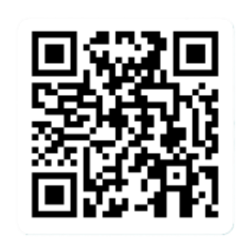

# Introduction
Suppose you own an e-commerce website selling bike accessories.  
You have millions of visitors a month, you want to analyze the website traffic, consumer patterns and predict sales.  
This workshop will walk you through the process of building an end-to-end Real Time Intelligence Solution in MS Fabric, using the medallion architecture, for your e-commerce website.  


You will learn how to:
* Build a medallion architecture in MS Fabric Real Time Intelligence
* Use Fabric data pipelines for copying data from an operational DB (SQL server with Adventure works sample data)
* Stream events and ingest them into MS Fabric RTI (Real Time Intelligence) using EventStream
* Create data transformations in Fabric RTI (Real Time Intelligence)
* Create reports for real time visualizations using RTI (Real Time Intelligence) dashboards

All the code in this tutorial can be found here:   
[Building a Medallion Architecture on Fabric Real Time Intelligence](<https://github.com/microsoft/FabricRTA-Retail/>)  

Also, here's a detailed [article](<https://techcommunity.microsoft.com/t5/startups-at-microsoft/building-a-real-time-medallion-architecture-using-eventhouse-in/ba-p/4110686>) explaining this tutorial.

### Authors
- [Denise Schlesinger](<https://github.com/denisa-ms>), Microsoft, Prin CSA
- [Hiram Fleitas](<https://aka.ms/hiram>), Microsoft, Sr CSA
- Guy Yehudy, Microsoft, Prin PM

### Feedback - Contributing
- Rate this lab or give us feedback to improve using this short [Eval](<https://forms.office.com/r/xhW3GAtAhi>). 
- If you'd like to contribute to this lab, report a bug or issue, please feel free to submit a Pull-Request to the [GitHub repo](<https://github.com/microsoft/FabricRTA-Retail/>) for us to review or [submit Issues](<https://github.com/microsoft/FabricRTA-Retail/issues>) you encounter.


---

# What is the Medallion Architecture?
The inspiration for this tutorial was the realization that **Eventhouse** aligns perfectly with the Medallion's architecture requirements. 

The Medallion architecture is a data design pattern with 3 layers:

🥉 The Bronze layer: containing raw data being streamed into a data platform, these are **Eventhouse** continuous ingestion capabilities.  

🥈 The Silver Layer: a curated enriched layer of data, based on transformed data from the Bronze layer. This can be achieved with Eventhouse's **update policies**.   

🥇 The Gold Layer: aggregated data for reporting and BI, this can be achieved with Eventhouse's **materialized views**.  

A medallion architecture (also coined by Databricks) is a data design pattern used to logically organize data. The goal is to **incrementally** improve the structure and quality of data as it flows through each layer of the architecture. Medallion architectures are sometimes also referred to as "multi-hop" architectures.

Creating a multi-layer data platform allow companies to improve data quality across the layers and at the same time provide for their business needs. Unstructured and raw data are ingested using scalable pipelines to output the highest quality enriched data.

Reference: https://dataengineering.wiki/Concepts/Medallion+Architecture

In summary, Microsoft Fabric Real-Time Intelligence (RTI) features benefit building a medallion architecture. They provide minimal latency for data in-motion, automatic light-weight transformations, dashboards, copilots to help you derive insights in a no-code experience, and allow you to take actions in real-time over your data. Additionally, all data is made avaiable via OneLake in delta-parquet format to Lakehouses using OneLake Availability as OneLogical copy for all your data. 

---

# Fabric Real Time Intelligence features 

Let's cover the key-features and how we plan to use them for our architecture.

### Event streams
- Clicks and Impressions events are ingested from an Eventstream into the `events` table. This feature allows us to bring real-time events into Fabric, transform them, and then route them to various destinations wihtout writing any code (no-code). Enhanced capabilities allows us to source data into Eventstreams from Azure Event Hubs, IoT Hubs, Azure SQL Database (CDC), PostgreSQL Database (CDC), MySQL Database (CDC), Azure Cosmos DB (CDC), Google Cloud Pub/Sub, Amazon Kinesis Data Streams, Confluent Cloud Kafka, Azure Blog Storage events, Fabric Workspace Item events, Sample data or Custom endpoint (Custom App).
- Feature [documentation](<https://learn.microsoft.com/fabric/real-time-analytics/event-streams/overview>).

### Data pipelines 
- Bronze layer tables are populated by a Data Factory pipeline to copy data from our operational SQL DB.
- Feature [documentation](<https://learn.microsoft.com/fabric/data-factory/tutorial-end-to-end-pipeline>).

### Shortcuts
- `Product` and `ProductCategory` SQL tables are defined as external tables (Fabric shortcuts). Meaning the data is not copied but served from the SQL DB itself. Shortcuts allow data to remain stored in outside of Fabric like in our operational SQL DB, yet presented in Fabric as a central location.
- Shortcuts enable us to create live connections between OneLake and existing target data sources, whether internal or external to Azure. This allows us to retrieve data from these locations as if they were seamlessly integrated into Microsoft Fabric.
- A shortcut is a schema entity that references data stored external to a KQL database in your cluster. In Lakehouses, Eventhouses, or KQL Databases it's possible to create shortcuts referencing Internal locations within Microsoft Fabric, ADLS Gen2, Spark Notebooks, AWS S3 storage accounts, or Microsoft Dataverse.
- From my perspective, I value the fact that all data is aligned under a unified namespace, allowing seamless access through the same ADLS Gen2 APIs, even when sourced from AWS S3. By enabling us to reference different storage locations, OneLake's Shortcuts provides a unified source of truth for all our data within the Microsoft Fabric environment and ensures clarity regarding the origin of our data.
- Feature [documentation](<https://learn.microsoft.com/fabric/real-time-analytics/onelake-shortcuts?tabs=onelake-shortcut>).

### Eventhouse
- The Eventhouse can host multiple KQL Databases for easier management. It will store relational data from an operational SQL DB, levergage shortcuts and automate transformations in real-time.
- The Eventhouse is the best place to store streaming data in Fabric. It provides a highly-scalable analytics system with built-in Machine Learning capabilities for discrete analytics over high-granular data. It's useful for any scenario that includes event-based data, for example, telemetry and log data, time series and IoT data, security and compliance logs, or financial records. The Eventhouse supports Kusto Query Languanguage (KQL) queries, T-SQL queries and Python. The data is automatically made available in delta-parquet format and can be easily accessed from Notebooks for mroe advanced transformaitons. The Eventhouse is specifically tailored to time-based, streaming/batch events with structured, semistructured, and unstructured data.
- Feature [documentation](<https://learn.microsoft.com/fabric/real-time-intelligence/eventhouse>).

### KQL Update policies
- This feature is also known as a mini-ETL. Update policies are automation mechanisms triggered when new data is written to a table. They eliminate the need for special orchestration by running a query to transform the ingested data and save the result to a destination table. Multiple update policies can be defined on a single table, allowing for different transformations and saving data to multiple tables simultaneously. **Target** tables can have a different schema, retention policy, and other policies than the **Source** table. The data in derived silver layer tables (targets) of our medallion architecture is inserted upon ingestion to bronze tables (sources). Based on Kusto's update policy feature, this allows to append transformed rows in real-time to a target table as data is landing in a source table and can also be set to run in a transaction. Meaning if the data from bronze fails to be transformed to silver, it will not be loaded to bronze either, by default this is set to off allowing maximum throughput.
- Feature [documentation](<https://learn.microsoft.com/azure/data-explorer/kusto/management/update-policy>).

### KQL Materialized Views
- Materialized views expose an aggregation query over a source table, or over another materialized view. We will use materialized views to create the Gold Layer in our medallion architecture. Most common materialized views provide the current reading of a metric or statistics of metrics over time. They can also be backfilled with historial data; however, by default they are automatically populated by newly ingested data.
- Feature [documentation](<https://learn.microsoft.com/azure/data-explorer/kusto/management/materialized-views/materialized-view-overview>).

### One Logical Copy
- Creates a one logical copy of KQL Database data by turning on OneLake availability. Turning on OneLake availability for your KQL tables, database or Eventhouse means that you can query the data in your KQL database in Delta Lake format via other Fabric engines such as Direct Lake mode in Power BI, Warehouse, Lakehouse, Notebooks, and more. When activated, it will copy via mirroring the KQL data to your Fabric Datalake in delta-parquet format. Allowing you to shortcut tables from your KQL Database via OneLake to your Fabric Lakehouse, Data Warehouse, and also query the data in delta-parquet format using Spark Notebooks or the SQL-endpoint of the Lakehouse.
- Feature [documentation](<https://learn.microsoft.com/fabric/real-time-analytics/one-logical-copy>).

### KQL Dynamic fields
- Dynamic fields are a powerful feature of Eventhouse / KQL DB that support evolving schema changes and object polymorphism, allowing to store different event types that have a common denominator of base fields.
- Feature [documentation](<https://learn.microsoft.com/azure/data-explorer/kusto/query/scalar-data-types/dynamic>).

### Kusto Query Language (KQL)
- KQL commands will be automatically written by the Get Data UI wizard when configuring the Eventhouse KQL Database destination in Eventstream. The commands will create the `events` table and JSON mapping. Secondly, the control commands will be issued in a database script that automate creation of additional schema items such as Tables, Shortcuts, Functions, Policies and Materialized-Views.
- KQL is also known as the language of the cloud. It's available in many other servies such as Microsoft Sentinel, Azure Monitor, Azure Resource Graph and Microsoft Defender. The code-name **Kusto** engine was invented by 4 engineers from the Power BI team over 10 years ago and has been implemented across all Microsoft services including Github Copilot, LinkedIn, Azure, Office 365, and XBOX.
- KQL queries are easy to write, read and edit. The language is most commonly used to analyze logs, sign-on events, application traces, diagnostics, signals, metrics and much more. Supports multi-statement queries, relational operators such as filters (where clauses), union, joins aggregations to produce a tabular output. It allows the ability to simply pipe (|) additional commands for ad-hoc analytics without needing to re-write entire queries. It has similaries to PowerShell, Excel functions, LINQ, function SQL, and OS Shell (Bash). It supports DML statements, DDL statements (referred to as Control Commands), built-in machine learning operators for forecasting & anomaly dectection, plus more... including in-line Python & R-Lang.
- Feature [documentation](<https://learn.microsoft.com/azure/data-explorer/kusto/query/>).

### Real-time Dashboards
- Will contain a collection of visual tiles _Click Through Rate_ stat KPIs, _Impressions_ area chart, _Clicks_ area chart, _Impressions by Location_ map for geo-spatial analytics and _Average Page Load Time_ in a line chart. This feature support filter parameters, additional pages, markdown tiles, inlcuding Plotly, multiple KQL datasources, base queries, embedding. Supports sharing with permissions controls, setting an Alert by leveraging Data Activator for actions, and automatic refresh with a minimum frequency of 30 seconds. These dashboards are commonly used for Operations and Power BI is commonly used for Business Intelligence. Power BI supports more advanced visualizations and rich data-story capabilities. Real-time Dashboards refresh very fast and allow with ease to togle between visual analytist to pro-developer that can explore queries or edit without needing to download a desktop tool. They make the experience simpler for analysts to visualize over high-granular data.
- Feature [documentation](<https://learn.microsoft.com/fabric/real-time-intelligence/dashboard-real-time-create>).

### Data Activator
- We will to Set an Alert in our Real-time Dashboard to message me in Teams. Data Activator (code-name Reflex) is a no-code experience in Microsoft Fabric for automatically taking actions when patterns or conditions are detected in changing data. It monitors data in Power BI reports, Eventstreams items and Real-time Dashboards, for when the data hits certain thresholds or matches other patterns. It then automatically takes appropriate action such as alerting users or kicking off Power Automate workflows.
- Some common use cases are:
  - Run Ads when same-store sales decline.
  - Alert store managers to move food from failing freezers before it spoils.
  - Retain customers who had a bad experience by tracking their journey through apps, websites etc.
  - Help logistics companies find lost shipments proactively by starting an investigation when package status isn't updated for a certain length of time.
  - Alert account teams when customers fall behind with conditional threasholds.
  - Track data pipeline quality, to either re-run jobs, alert for detected failures or anomalies.
- Feature [documentation](<https://learn.microsoft.com/fabric/data-activator/data-activator-introduction>).

---

# The e-commerce store   

The e-commerce store database entities are:  
* Product: the product catalog. 
* ProductCategory: the product categories.  
* Customer: the customers that purchased items in the store.
* Address: the addresses of the customers.
* SalesOrderHeader: the metadata for the orders.
* SalesOrderDetail: every item purchased in an order.
* Event: a click or impression event.   
  - An impression event is logged when a product appears in the search results.
  
  - A click event is logged when the product is clicked and the customer has viewed the details.  
  

Photo by <a href="https://unsplash.com/@himiwaybikes?utm_content=creditCopyText&utm_medium=referral&utm_source=unsplash">Himiway Bikes</a> on <a href="https://unsplash.com/photos/black-and-gray-motorcycle-parked-beside-brown-wall-Gj5PXw1kM6U?utm_content=creditCopyText&utm_medium=referral&utm_source=unsplash">Unsplash</a>  
Photo by <a href="https://unsplash.com/@headaccessories?utm_content=creditCopyText&utm_medium=referral&utm_source=unsplash">HEAD Accessories</a> on <a href="https://unsplash.com/photos/silver-and-orange-head-lamp-9uISZprJdXU?utm_content=creditCopyText&utm_medium=referral&utm_source=unsplash">Unsplash</a>  
Photo by <a href="https://unsplash.com/@jxk?utm_content=creditCopyText&utm_medium=referral&utm_source=unsplash">Jan Kopřiva</a> on <a href="https://unsplash.com/photos/a-close-up-of-a-helmet-with-sunglasses-on-it-CT6AScSsQQM?utm_content=creditCopyText&utm_medium=referral&utm_source=unsplash">Unsplash</a>
  

---

 # Architecture


---

# Data schema

## Data flow
  


## Tables
| Table| Origin     | Description|
|------|------------|------------|
| Customer| Copied using Pipeline| Describes customers and their geographic location|
| Address| Copied using Pipeline|Customers addresses|
| SalesOrderHeader| Copied using Pipeline|Information about sales orders|
| SalesOrderDetail| Copied using Pipeline|Detailed information about sales orders, including product IDs and quantities sold|
| Product|Shortcut to SQL DB|Products, including descriptions and prices|
| ProductCategory|Shortcut to SQL DB|Product category|
| SilverCustomer|EventHouse table|Table created based on an update policy with transformed data|
| SilverAddress|EventHouse table|Table created based on an update policy with transformed data|
| SilverOrdersHeader|EventHouse table|Table created based on an update policy with transformed data|
| SilverOrdersDetail|EventHouse table|Table created based on an update policy with transformed data|
| GoldAddress|EventHouse table|Materialized view showing only the latest changes in the source table showing how to handle duplicate or updated records|
| GoldCustomer|EventHouse table|Materialized view showing only the latest changes in the source table showing how to handle duplicate or updated records|
| GoldSalesOrderHeader|EventHouse table|Materialized view showing only the latest changes in the source table showing how to handle duplicate or updated records|
| GoldSalesOrderDetail|EventHouse table|Materialized view showing only the latest changes in the source table showing how to handle duplicate or updated records|
| Event|EventHouse table|Streaming events representing the product being seen or clicked by the customer. Will be streamed into Fabric Eventhouse from an eventstream. We will push synthetic data (fake data) into an endpoint, using a Fabric Notebook.|


---

# Pre-requisites
- Recommended material to review (at least one) prior to this lab, however it's not required:
  - https://aka.ms/learn.kql
  - [Real-Time Intelligence Tutorial](<https://learn.microsoft.com/fabric/real-time-intelligence/tutorial-introduction>)
- To complete the lab you **must** have access to a [Microsoft Fabric](<https://www.microsoft.com/microsoft-fabric/getting-started>) workspace with at least Contributor permissions.

If you need a new Trial Tenant, suggest to register a new Outlook.com email and follow these steps:
1. [Provision Fabric Trial Tenant](<https://github.com/microsoft/FabricRTA-in-a-Day/tree/main/assets/trialtenant>) - see document and powershell script to setup a lab admin, 25 workspaces and 24 additional logins (one workspace per user will be automatically created). Attendies can create items specified in lab excercises in their own workspace.
2. [Office 365 E5 Trial](<https://blog.fabric.microsoft.com/blog/accessing-microsoft-fabric-for-developers-startups-and-enterprises>). ⚠️ Make sure to disable recurring billing, otherwise your credit card will be charged for Office E5.

---

# Building the Analytics platform
## Fabric Workspace 
Create a Fabric Workspace


## Create a new Eventhouse  
Create an Eventhouse called "RTAdemo"  


## Accessing your Eventhouse data in a Lakehouse
In this section we will enable an Eventhouse feature called "one logical copy" that allows the KQL DB tables to be accessed from a data lakehouse in parquet format.

When activated, it will constantly copy the KQL data to your Fabric Datalake in delta format. Allowing you to query the data in your KQL database in Delta Lake format using Spark or SQL endpoint on the Lakehouse.
This is the reason we need to activate this feature "before" we load the data into our KQL DB.


You can read more about this here.  
[Announcing Delta Lake support in Real-Time Intelligence KQL Database](<https://support.fabric.microsoft.com/blog/announcing-delta-support-in-real-time-analytics-kql-db?ft=All>)   

Enabling data availability of KQL Database in OneLake means that customers can enjoy the best of both worlds: they can query the data with high performance and low latency in their KQL database and query the same data in Delta Lake format via any other Fabric engines such as Power BI Direct Lake mode, Warehouse, Lakehouse, Notebooks, and more.

KQL Database offers a robust mechanism to batch the incoming streams of data into one or more Parquet files suitable for analysis. The Delta Lake representation is provided to keep the data open and reusable. This logical copy is managed once, is paid for once and users should consider it a single data set.

Here is how to set this up.  
Click on the pencil icon next to the OneLake availability  

Click active and "Done" button

Build a new Lakehouse called "RTADemoLakehouse"

Click on "Get data" - New shortcut

Select Microsoft OneLake

Select all the tables in our Eventhouse KQL DB and click "Next"

Click "Create"

Now you will have the Eventhouse KQL DB tables available in your Lakehouse. You can query them as any Lakehouse tables


## Create a new Eventstream  
In this section we will be streaming events (impressions and clicks events) generated by a notebook. The events will be streamed into an eventstream and consumed by our Eventhouse KQL DB.


Create an Eventstream called "RTADemoEventStream"  


When we create a "Custom app" as a source, an event hub is created and connected to the EventStream for us.  
Click on the Eventstream source - Custom App to get the event hub endpoint and key to send the events from our notebook.  

  

Click on "Sample code" and copy the connectionString to a notepad


Click on "Keys" and copy the event hub name to a notepad


## Import Data Generator Notebook
Import the [Generate synthetic events notebook](<https://github.com/microsoft/FabricRTA-Retail/blob/main/notebooks/Generate%20synthetic%20events.ipynb>) to generate events using streaming


Copy the connectionstring and key you pasted into a notepad in the previous step and paste it in the Notebook first code block


## Run the notebook
Open the "generate synthetic events" notebook in your Fabric Workspace.  
Check the python version is "3.10.12.  
Run all the cells in the notebook to start generating streaming events.  


## Define destination in the EventStream
Open the EventStream in your Fabric Workspace.  
Select "New Destination" - KQL Database.  


Select Workspace and the KQL DB we created called "RTADemo"


Create a new table in our KQL DB called "Event".  


You will see a sample of the streaming data showing click and impression events, Click Finish and Close.  


Now, we can see the EventStream destination is in mode "Ingesting".  


## Build the KQL DB schema
In this section we will create all the tables in our Eventhouse KQL DB.
Two of the tables (product and productCategory) are shortcuts to our SQL DB and the data is NOT being copied into our KQL DB.


Open the RTADemo Eventhouse from your Fabric Workspace.  Click on "Explore your Data".  


Run the KQL scripts to create all the tables.  
Open the  [createAll.kql](<https://github.com/microsoft/FabricRTA-Retail/blob/main/kql/createAll.kql>) file and copy the entire file content.  

Paste it in the KQL panel in the KQL DB and run it.  


## Data pipeline
In this section we will demonstrate how to use Fabric Data pipelines to copy data from our SQL DB into our Eventhouse KQL DB using batch ingest.
This ingestion type can be a one time ingestion or can be scheduled to run periodically.


Create the Data Pipelines that you can run periodically to copy data to our Eventhouse DB.

Name it "Copy Address table".  


Select the Pipeline Activity - Copy data activity 


Select Source - External and click "+" to create a new connection to the SQL DB


Fill in the details as follows:  
```
ServerName = adxdemo.database.windows.net
DatabaseName = aworks
UserName = sqlread
Password = ChangeYourAdminPassword1

```


After creating and testing the Data Connection to the SQL DB, select Database and Table "SalesLT.Address".  


Click on "Destination" tab, select "Workspace"- KQL DB - RTADemo - Address as target table.  


Click on "mapping" tab - Import schemas - and make sure all fields are mapped to the correct types with no warnings.  

Click "run" to execute the pipeline.


The pipeline will run until you see status "succeeded".


Run the pipeline again by clicking the "Run" button.
We are running the data pipeline twice to show how we are deduping rows.  

Let's check the data we copied.  
Go to our KQL RTADemo Database in your Fabric Workspace.
When running the query - we see 900 rows
```
Address
```
  

In the SQL DB (source) we have 450 rows


Now go to our KQL RTADemo Database in your Fabric Workspace.  
Run the following query  
```
SilverAddress
```
We see there are 900 rows and 1 additional column (IngestionDate) 


Run the following query  
```
GoldAddress
```
We see there are 450 rows since the Gold layer contains materialized views using the maximum IngestionDate to show only the latest ingested rows.
```
//GOLD LAYER
// use materialized views to view the latest changes in the orders table
.create materialized-view with (backfill=true) GoldAddress on table SilverAddress
{
    SilverAddress
    | summarize arg_max(IngestionDate, *) by AddressID
}
```


<div class="info" data-title="Note">  

> Repeat all the steps in the Data pipeline creation for the Customer, SalesOrderHeader and SalesOrderDetail.
> Pay attention that the SalesOrderDetail mapping requires you to map money type from SQL to the decimal data type in KQL.  
</div>


# RTA Dashboard
We will build a real time dashboard to visualize the streaming data.  
It will be refreshed every 30 seconds.


Go to your Fabric Workspace and click on New - More options


Scroll down and choose Real Time Dashboard

Name it "RTA Dashboard"  


## Define Data source  


## Create all dashboard tiles 
All KQL queries for the tiles can be found in the  [dashboard-RTA.kql](<https://github.com/microsoft/FabricRTA-Retail/blob/main/dashboards/RTA%20dashboard/dashboard-RTA.kql>) file

### Clicks by date 
```
//Clicks by hour
events 
| where eventDate between (_startTime.._endTime) and eventType == "CLICK" 
| summarize date_count = count() by bin(eventDate, 1h) 
| render timechart  
| top 30 by date_count 
```

```
//Impressions by hour
events 
| where eventDate between (_startTime.._endTime) and eventType == "IMPRESSION" 
| summarize date_count = count() by bin(eventDate, 1h) 
| render timechart  
| top 30 by date_count 
```

```
//show map of impressions location
events 
| where eventDate  between (_startTime.._endTime) and eventType == "IMPRESSION" 
| join external_table('products') on $left.productId == $right.ProductID 
| project lon = geo_info_from_ip_address(ip_address).longitude, lat = geo_info_from_ip_address(ip_address).latitude, Name 
| render scatterchart with (kind = map)
```


```
//Average Page Load time
events 
| where eventDate   between (_startTime.._endTime) and eventType == "IMPRESSION" 
| summarize average_loadtime = avg(page_loading_seconds) by bin(eventDate, 1h) 
| render linechart 
```

The 3 tiles showing a card with a number use the same query (see below) but show a different field.  
```
let imp =  
events 
| where eventDate  between (_startTime.._endTime) and eventType == "IMPRESSION" 
| extend dateOnly = substring(todatetime(eventDate).tostring(), 0, 10) 
| summarize imp_count = count() by dateOnly; 
let clck =  
events 
| where eventDate  between (_startTime.._endTime) and eventType == "CLICK" 
| extend dateOnly = substring(todatetime(eventDate).tostring(), 0, 10) 
| summarize clck_count = count() by dateOnly;
imp  
| join clck on $left.dateOnly == $right.dateOnly 
| project selected_date = dateOnly , impressions = imp_count , clicks = clck_count, CTR = clck_count * 100 / imp_count
```


## Stop running the notebook


## THAT's ALL FOLKS!!

🎉 Congratulations on completing this lab! 

Did you like it, did you not like it? Let us know in this short [Eval](<https://forms.office.com/r/xhW3GAtAhi>).

  

If you'd like to contribute to this lab or report a bug-issue, please send a Pull-request for us to review or submit the issue in our [GH repo](<https://github.com/microsoft/FabricRTA-Retail/>).

## Continue your learning

- https://aka.ms/learn.kql
- https://detective.kusto.io, https://detective.kusto.io/sans2023
- https://aka.ms/fabric-learn
- [Implement a Real-Time Intelligence Solution with Microsoft Fabric](<https://learn.microsoft.com/training/paths/explore-real-time-analytics-microsoft-fabric/>)
- https://aka.ms/fabricblog
- https://aka.ms/adx.blog
- https://aka.ms/adx.youtube
